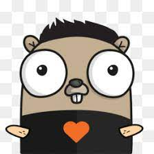

[Go](https://go.dev/)

# Projetos em Golang

Estudo e projetos da _linguagem_ **Golang**

```golang 
package main

import "fmt"

func main() {
	fmt.Println("Seja Bem Vindo!")
}
```


## Funcionabilidades

### Linguagens do Projetos

 * Golang
 * SQL Potgres
 * NodeJS  
 
 
### Funcionabilidades a Melhoras

1. Autenticação JWT 
	1. Melhorar a Lógica do **Secret**
	2.  Aumentar o tempo de validação do Token.
2. Torna-lo Escalavél. 
